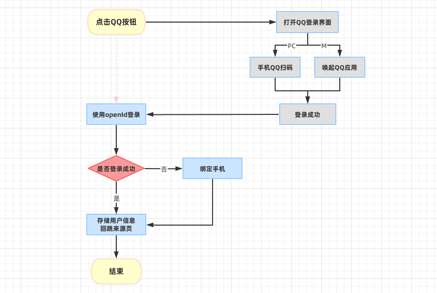
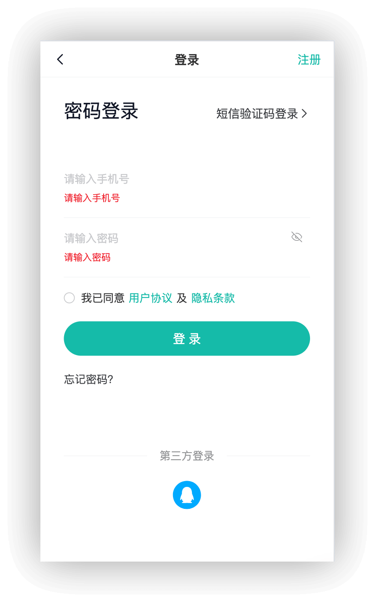
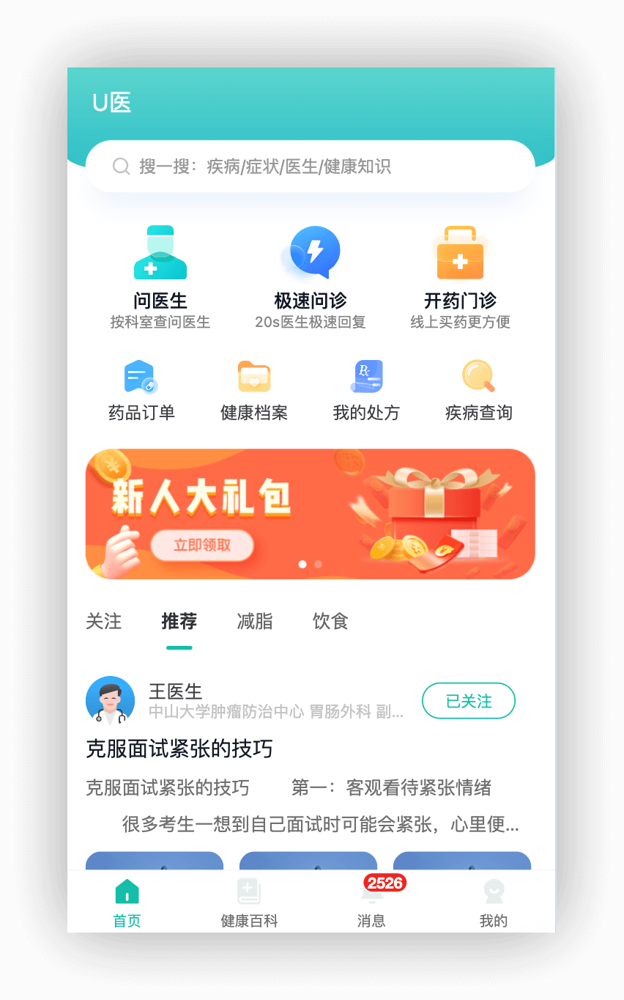
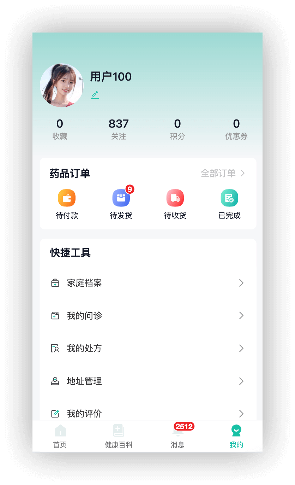
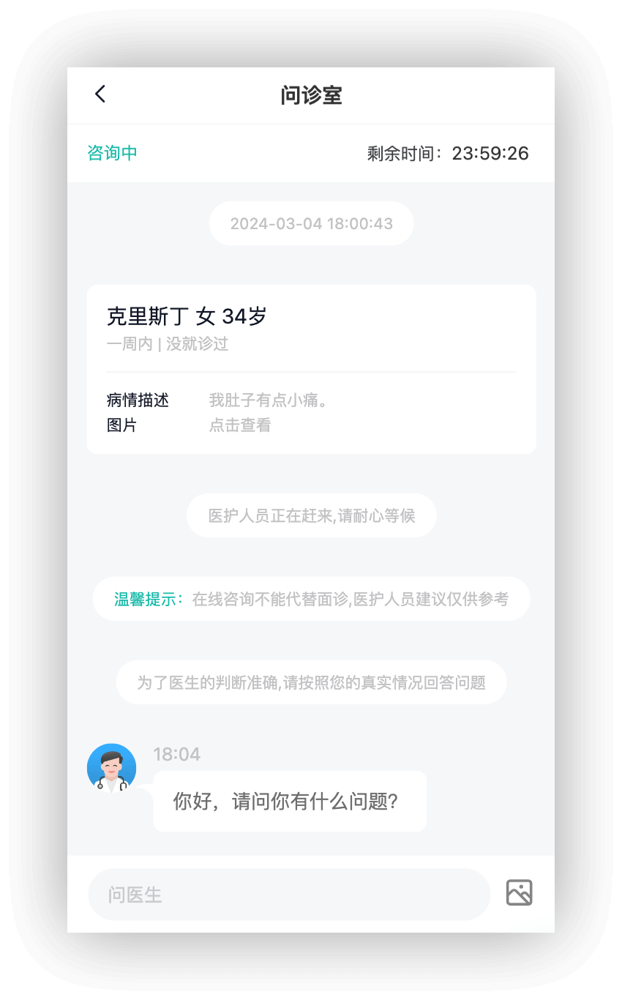
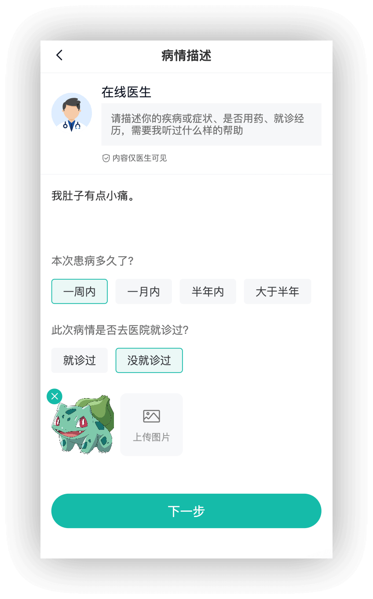
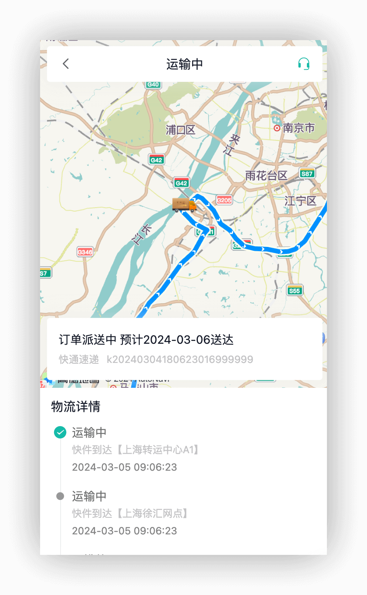
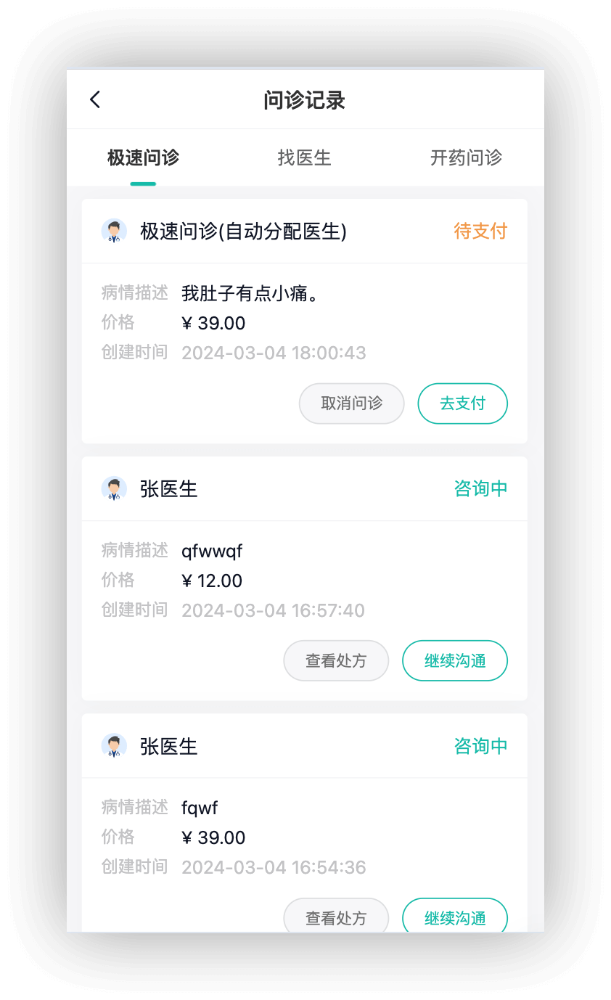
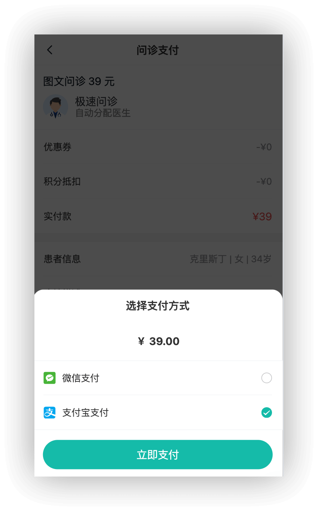

# 移动端: uyi-h5

技术栈：Vue3 + Typescript + Pinia + Vite + Axios + Vant + Scss + Postcss + Pnpm + Husky + Eslint

次要：
- pinia-plugin-persistedstate 适用于 Pinia 的持久化存储插件
- unplugin-vue-components 按需自动导入组件
- unplugin-auto-import 按需自动导入 API
- vite-plugin-svg-icons 用于生成 svg 雪碧图
- postcss-px-to-viewport 将px单位转换为视口单位的 (vw, vh, vmin, vmax) 的 PostCSS 插件.

### 参考
[eslint-plugin-vue中文文档](https://www.cnblogs.com/qq3279338858/p/16617032.html)

[这可能是vue中eslintrc.js最详细的介绍了](https://segmentfault.com/a/1190000017461203)

[Vue3项目ESLint配置及介绍](http://www.huhaowb.com/2022/10/11/vite%E5%88%9B%E5%BB%BAVue3%E9%A1%B9%E7%9B%AE%E9%85%8D%E7%BD%AEESLint)

[一文彻底读懂ESLint](https://xieyufei.com/2021/04/25/Front-Eslint.html)

### Vue + Ts 项目配置 ESLint 所需插件  

- eslint ESLint 的核心代码

- eslint-plugin-vue Vue.js 的官方 ESLint 插件，它允许我们使用 ESLint 检查文件中的 Vue 代码

- @typescript-eslint/parser ESLint 的解析器，用于解析 typescript，从而检查和规范 Typescript 代码

- @typescript-eslint/eslint-plugin 包含了各类定义好的检测 Typescript 代码的规范

### 移动端H5适配方案：

1. rem 布局

```bash
- amfe-flexible
amfe-flexible 是配置可伸缩布局方案，主要是将 1rem 设为 viewWidth / 10。

- postcss-pxtorem
postcss-pxtorem 是 postcss 的插件，用于将像素（px）单元生成 rem 单位。
```
2. vw 布局（本项目采用）

```bash
- postcss-px-to-viewport
```

### 第三方支付解决方案（支付宝）

<!--  -->

**支付流程**

- 点击支付按钮，调用生成订单接口，得到 订单ID，打开选择支付方式对话框
- 选择支付方式，（测试环境需要配置 回跳地址）调用获取支付地址接口，得到支付地址，跳转到支付宝页面
- 使用支付宝APP支付（在手机上且安装沙箱支付宝）
- 使用浏览器账号密码支付 （测试推荐）
- 支付成功回跳到问诊室页面

### 第三方登录-QQ登录流程



- 需要在 QQ互联 平台注册。
- 需要实名身份认证，审核通过。
- 然后创建我的web应用，需要有网站域名，需要域名备案号，设置登录成功回跳地址，审核通过。
- 得到 appid 和 回跳地址。

步骤：

1.准备QQ登录按钮  
2.准备回跳页面  
3.使用 openID 进行登录  
4.登录成功，跳转到来源页面  
5.登录失败，显示绑定手机界面  
6.绑定成功，跳转到来源页面  

### 成果展示

<div  align="center">    
  
  
  
  
  
  
  
  
</div>

<!-- 


 -->
